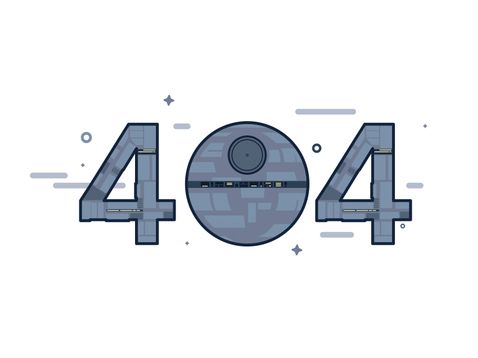

# 404 - 页面不存在

***

**非常抱歉，您访问的页面不存在**

<a href="#/" style="display: inline-block; padding: 12px 32px; background: linear-gradient(135deg, #4155c4 0%, #5e72e4 100%); color: #ffffff; text-decoration: none; border-radius: 8px; font-size: 16px; font-weight: 600; margin-top: 20px; box-shadow: 0 4px 15px rgba(65, 85, 196, 0.3); transition: all 0.3s ease;">返回首页</a>

